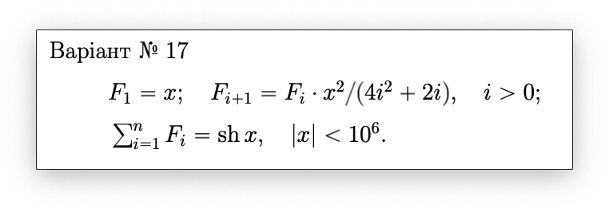

# Лабораторна робота 1. Рекурсивні алгоритми

## Мета лабораторної роботи 
Метою лабораторної роботи №1 «Рекурсивні алгоритми» є засвоєння теоретичного матеріалу та набуття практичного досвіду створення рекурсивних алгоритмів та написання відповідних їм програм.

## Постановка задачі
Дане натуральне число n. Знайти суму перших n членів ряду чисел, заданого рекурентною формулою. Розв'язати задачу трьома способами: 
1. У програмі використати рекурсивну функцію, яка виконує обчислення n членів ряду, і суми на рекурсивному спуску.
2. У програмі використати рекурсивну функцію, яка виконує обчислення n членів ряду, і суми на рекурсивному поверненні.
3. У програмі використати рекурсивну функцію, яка виконує обчислення членів ряду на рекурсивному спуску, а обчислення суми на рекурсивному поверненні.

При проектуванні програм слід врахувати наступне: 
- Програми повинні працювати коректно для довільного цілого додатного n включно з n = 1.
- Видимість змінних має обмежуватися тими ділянками, де вони потрібні.
- Функції повинні мати властивість модульності.
- У кожному з трьох способів рекурсивна функція має бути одна (за потреби, можна також використати додаткову функцію-обгортку (wrapper function)).
- У другому способі можна використати запис (struct) з двома полями (але в інших способах у цьому немає потреби і це вважатиметься надлишковим).
- Програми мають бути написані мовою програмування С.

## Варіант 17:

